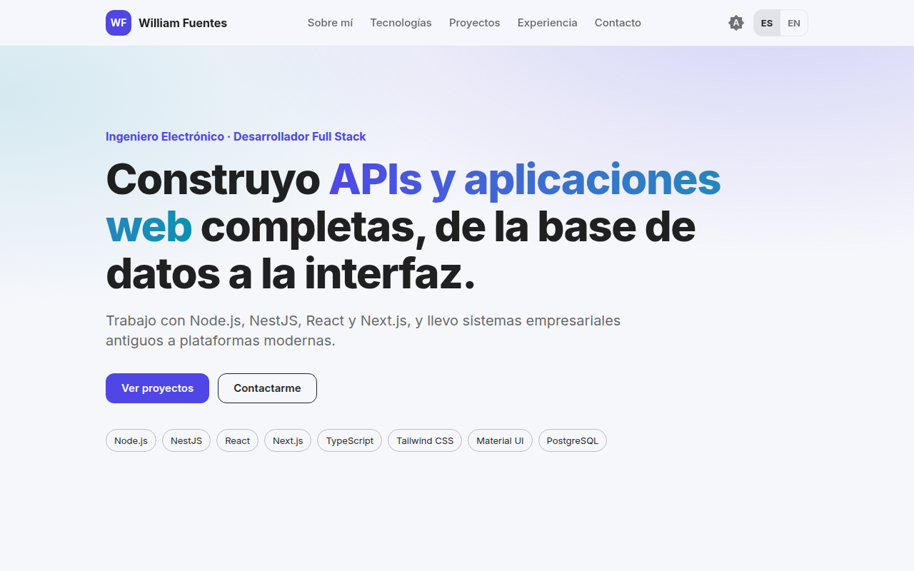

# Portfolio

Personal portfolio website built with **Next.js 15** (static export), **React 19**, **TypeScript**, **Tailwind CSS** and **Material UI**. It is bilingual (Spanish and English), responsive from 320px up, and has light, dark and system themes.



## Features

- Static export: deploys to GitHub Pages, Vercel, Netlify or any static host
- Spanish / English toggle that defaults to the browser language and remembers the choice
- Light, dark and system themes shared by Tailwind and Material UI
- Accessible: skip link, semantic headings, focus states, labelled controls and descriptive image alternatives
- Links (GitHub, email, live demos) are configured with environment variables; empty values hide the matching buttons
- Tests with Vitest and Testing Library (translations, configuration and page behaviour)
- GitHub Actions workflow that lints, tests, builds and publishes to GitHub Pages

## Tech stack

Next.js 15 · React 19 · TypeScript · Tailwind CSS 4 · Material UI 7 · Vitest · Testing Library · GitHub Actions

## Getting started

```bash
npm install
cp .env.example .env.local   # optional
npm run dev
```

Open `http://localhost:3000`.

## Customize

Text lives in `src/content/messages.ts` (one object per language, checked by tests so both stay in sync). Links come from environment variables:

| Variable | Description |
| --- | --- |
| `NEXT_PUBLIC_GITHUB_USER` | Your GitHub username. Enables the GitHub and repository buttons |
| `NEXT_PUBLIC_EMAIL` | Public contact email (optional) |
| `NEXT_PUBLIC_LINKEDIN` / `NEXT_PUBLIC_FIVERR` | Profile URLs |
| `NEXT_PUBLIC_DASHBOARD_URL` | Deployed dashboard URL (enables "Live demo") |
| `NEXT_PUBLIC_API_DOCS_URL` | Deployed API documentation URL (enables "Documentation") |
| `NEXT_PUBLIC_BASE_PATH` | Only for GitHub Pages project sites, for example `/portfolio` |

Project screenshots are in `public/images`.

## Scripts

```bash
npm run dev      # development server
npm run build    # static export to ./out
npm run lint     # ESLint
npm test         # Vitest
```

## Deploy

**GitHub Pages (automatic):**

1. Push the repository to GitHub.
2. In **Settings > Pages**, set **Source** to **GitHub Actions**.
3. Push to `main`. The workflow in `.github/workflows/deploy.yml` builds the site and publishes it at `https://<user>.github.io/<repository>/`. The GitHub username and base path are detected automatically.
4. Optional: in **Settings > Secrets and variables > Actions > Variables**, add `DASHBOARD_URL`, `API_DOCS_URL` and `CONTACT_EMAIL` to enable the demo and email buttons.

**Vercel or Netlify:** import the repository. The build command is `npm run build` and the output directory is `out`.

## License

MIT
